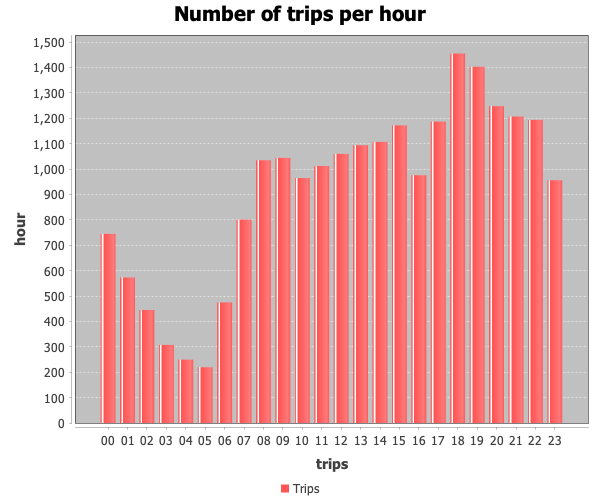
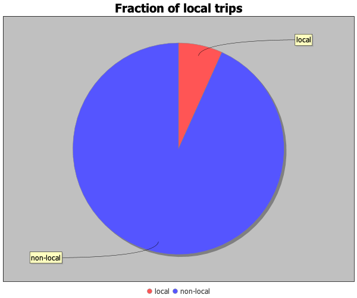
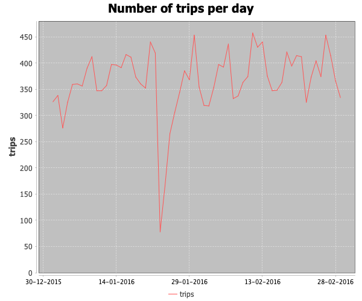

# Charts using DBConnect (Scala) and JFreeChart

This simple application visualizes taxi trips data using remote server queries.

The visualization is done using popular library [JFreeChart](https://www.jfree.org/jfreechart/)

## Getting started

1. Import the project into your favorite IDE that can build Scala projects.
2. To run, make sure to set the environment variables for `DATABRICKS_HOST`,
`DATABRICKS_TOKEN`, `DATABRICKS_CLUSTER_ID`.
Alternatively, please see [docs](https://docs.databricks.com/en/dev-tools/databricks-connect-ref.html#set-up-the-client)
for other ways to configure connection with server.

## Plots

The application produces the following plots

